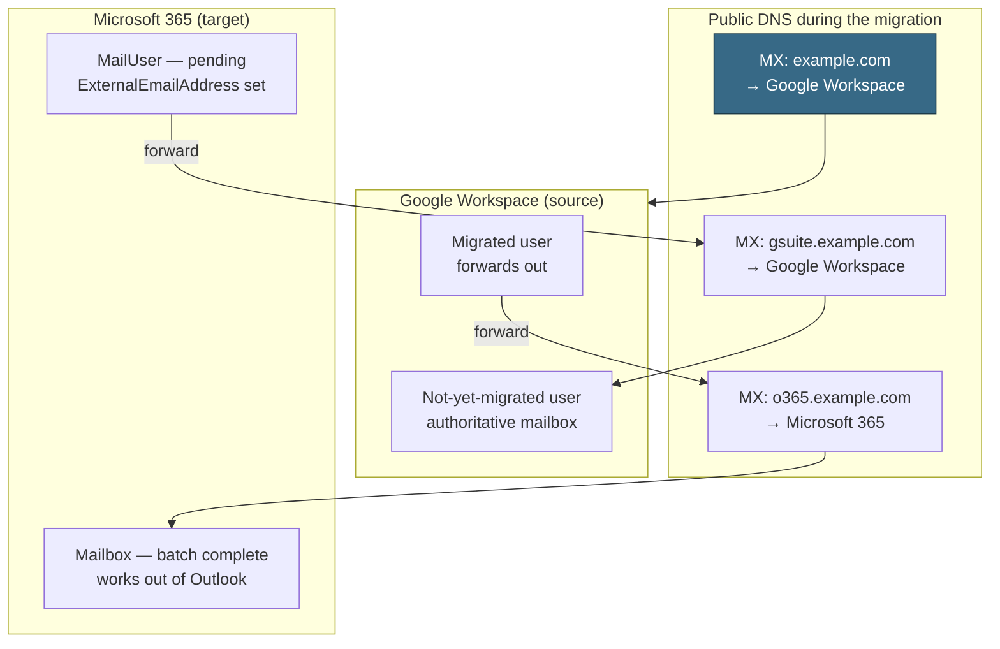

Every Google Workspace to Microsoft 365 migration gets sold as "move the mail." It isn't. The data copy is the easy half and the part Microsoft automates for you. The hard half is mail routing: for days or weeks, half your users answer mail out of Gmail and half out of Outlook, and every message sent to either group has to land in the right mailbox without anyone thinking about it. Get the routing model right and the migration is boring. Get it wrong and you find out after the batch is already running, which is the worst possible time.

This is the manual path — you configure the Google side yourself with a service account instead of letting Microsoft's automated wizard do it. It takes longer and it is the one to use when the client's Google tenant is locked down, when the automated flow has already failed, or when you want to see exactly which permissions you granted and to what. Read it alongside [[The BASH engagement method]] for how we sequence the work, and [[The deterministic-first doctrine]] for why the pre-flight below is a script and not a checklist someone reads.

## The routing model, which is the whole trick

Microsoft's staged Google Workspace migration works by adding **two routing subdomains** to the Google tenant, then flipping each user's forwarding direction as their batch completes. In public Domain Name System (DNS) records, the primary domain's mail exchange (MX) record stays pointed at Google for the entire project. It moves once, at the end, after every batch is done.

Per-user, the sequence is: a mail user in Microsoft 365 forwards inbound mail back to the still-authoritative Gmail mailbox → the batch starts and converts that mail user into a real mailbox → the batch completes, the Microsoft-to-Google forwarding is removed, and Google-to-Microsoft forwarding is added in its place. From that moment the user works out of Outlook, and mail addressed to their Gmail address follows them.



Two consequences worth stating out loud to a client before you start. First, the routing subdomains and the extra aliases are scaffolding — they get torn down after cutover, and nobody outside the project ever sees them. Second, because the primary MX record does not move until the end, a failed batch is recoverable: the source mailboxes are still live and still authoritative. That property is what makes the staged approach worth its extra moving parts. Microsoft's [overview of the migration process](https://learn.microsoft.com/en-us/exchange/mailbox-migration/how-it-all-works-in-the-backend) diagrams each of these states.

## Scope: what moves, what silently doesn't

The tool migrates mail and rules, calendar, and contacts. That is the entire list. Everything else in a Google Workspace tenant is a separate workstream, and the gap between "we're migrating off Google" and "we're migrating the mailboxes" is where scope disputes come from. Set the boundary in writing during discovery.

| Data type | What Microsoft states does not migrate |
| --- | --- |
| Mail | Vacation settings and automatic reply settings |
| Mail rules | Rules migrate, but arrive **turned off** — users verify them in Outlook before enabling |
| Meeting rooms | Room bookings are not migrated |
| Calendar | Shared calendars and event colors are not migrated |
| Contacts | A maximum of three email addresses per contact; Gmail tags, contact URLs, and custom tags are dropped |

Out of scope entirely, and worth naming explicitly in the statement of work: Google Drive and shared drives, Google Groups, Sites, Chat and Meet history, Vault and anything held under a Vault retention rule, and any third-party application that authenticates through Google identity. A Drive-to-OneDrive move is its own project with its own tooling.

Two hard limits to check before you promise a date. The largest single message that migrates is governed by your Exchange Online transport configuration, which **defaults to 35 MB** — raise the [Exchange Online message limits](https://learn.microsoft.com/en-us/office365/servicedescriptions/exchange-online-service-description/exchange-online-limits) first if the client has a habit of mailing large attachments. And throughput for contacts and calendars is bounded by the Google-side quota on your service account, not by anything you configure in Microsoft 365 — the endpoint's concurrency settings do not help there. Migration is also not available for Government Community Cloud High (GCC High) or Department of Defense (DoD) tenants. The full list lives in Microsoft's [Google Workspace migration limitations](https://learn.microsoft.com/en-us/exchange/mailbox-migration/perform-g-suite-migration).

## Confirm the state you're actually migrating

Before you configure anything, establish from outside the tenant where mail currently flows. Migrations get inherited half-finished, and a tenant that has already been partially moved looks identical to one that hasn't until you check. Every command here is read-only and needs no credentials.

```bash
# Where does mail for this domain actually land right now?
dig +short MX example.com

# CRITICAL: resolve the MX *target*, not just the record. A record that names a
# host which does not exist is indistinguishable from a correct one until you ask.
for r in 8.8.8.8 1.1.1.1 9.9.9.9; do
  host=$(dig +short @"$r" MX example.com | sort -n | head -1 | awk '{print $2}' | sed 's/\.$//')
  printf '%-16s %s -> %s\n' "$r" "$host" "$(dig +short @"$r" A "$host" | head -1 || echo UNRESOLVED)"
done

# Which Microsoft 365 tenant, if any, already claims the domain?
curl -s "https://login.microsoftonline.com/example.com/v2.0/.well-known/openid-configuration" \
  | python3 -c 'import json,sys; print(json.load(sys.stdin)["issuer"])'

# Leftover scaffolding from an earlier attempt: routing subdomains, stale verification
# tokens, and Google DKIM records that outlived the tenant they signed for.
dig +short TXT example.com
dig +short TXT google._domainkey.example.com
dig +short MX o365.example.com gsuite.example.com
```

Read the answers before you plan the work:

- **The MX record already points at `*.mail.protection.outlook.com`.** The cutover has happened.
  Whatever is left to do, it is not the staged migration in this guide — and running the routing steps now, against a mailbox whose mail already lands in Exchange Online, is how you create a mail loop.
- **The source and target domains return the same issuer.** They are one tenant, so there is no
  migration here at all. Moving a user between two domains inside a single tenant is a primary-address change or a mailbox-to-mailbox copy, not a tenant migration.
- **The MX target does not resolve.** The record exists, names a plausible
  `*.mail.protection.outlook.com` host, and the tenant reports the domain healthy — but the hostname returns `NXDOMAIN`. External senders cannot connect, so every inbound message defers and eventually bounces, while internal tenant-to-tenant mail keeps working perfectly and hides it. See the failure mode below; this is not hypothetical.
- **Google DKIM or verification records are still published on a domain whose MX moved.** Inert
  leftovers, but they are the tell that a migration ran and its teardown never finished. Clean them up as part of the engagement.

## When this is the wrong tool

The staged model earns its moving parts on a whole-tenant cutover with users in flight on both sides. It is the wrong instrument for a single mailbox, or for a tenant whose MX record has already moved and just needs its historical Gmail content pulled across. Both of those cases want an Exchange Online **IMAP migration batch**, an export and import, or an Outlook profile holding both accounts — none of which touch DNS, routing subdomains, or forwarding. Reach for the routing-domain model when you are moving an organization, not a mailbox.

## The Google side: the service account and its scopes

You need a Google administrator who can create projects and service accounts. Two granular permissions cover it — `resourcemanager.projects.create` and `iam.ServiceAccounts.create` — and the cleanest way to grant them is the **Project Creator** and **Service Accounts Creator** roles, assigned under **IAM & Admin → Manage Resources** (identity and access management) in the Google Cloud console. Role assignments take up to 15 minutes to propagate.

Then, following Microsoft's [manual Google Workspace configuration procedure](https://learn.microsoft.com/en-us/exchange/mailbox-migration/manually-configuring-gsuite-for-migration):

1. **Create the project and service account.** Note the service account's **Unique ID** — that is the
   client ID you paste into domain-wide delegation later, and hunting for it after the fact is a small waste of your time.
2. **Enable domain-wide delegation** on the service account. Google asks for a product name for the
   consent screen; the migration never uses it, but the dialog will not save without it.
3. **Create a JavaScript Object Notation (JSON) key** and download it. This file is a credential that
   can read every mailbox in the tenant. Treat it accordingly: never commit it, hand it over through a secret manager rather than email, and delete the service account when the project closes.
4. **Enable the application programming interfaces (APIs)** on the project — Gmail API, Google
   Calendar API, and **People API**, which is what now serves contacts. Verify each one reads `Manage` rather than `Enable` on its page in the Cloud console. This is the single step most likely to be skipped and by far the most expensive to skip, for reasons the failure-modes section below sets out: a missing API here does not produce a missing-API error. It produces an authentication error, days later, that will send you to audit credentials that were never wrong.
5. **Authorize the scopes** under Security → API Controls → Manage Domain Wide Delegation, adding the
   service account's client ID with the scope list below.

Granting a scope and enabling the API that serves it are two independent switches, and only one of them is visible from the Google Workspace admin console. Domain-wide delegation can show a perfectly correct `auth/contacts` grant while the People API sits disabled in the Cloud project — the admin console has no idea, and reports nothing wrong.

The scopes go in as one comma-separated string with **no spaces** anywhere in it:

```text
https://mail.google.com/,https://www.googleapis.com/auth/calendar,https://www.google.com/m8/feeds/,https://www.googleapis.com/auth/gmail.settings.sharing,https://www.googleapis.com/auth/contacts
```

A discrepancy worth understanding before it sends you down a blind alley: Microsoft's page tells you to verify that the resulting list shows **four** scopes, while the example string it supplies contains **five**. The instruction is right and the string is stale, and the reason is not a typo.

`https://www.google.com/m8/feeds/` belongs to the old Contacts API, which Google [turned down on 19 January 2022](https://developers.google.com/people/contacts-api-migration). Google keeps that scope alive as a **legacy alias for `https://www.googleapis.com/auth/contacts`** — so when both appear in the string you paste, the console stores one grant, not two. Paste five, get four, no error and no warning.

That matters because a four-scope list is the **correct** end state, not evidence of a defect. If a migration is failing and you go hunting for a missing fifth chip, you will burn an afternoon trying to add a scope Google will keep silently discarding, because the permission it conveys is already granted under its modern name. Verify the four by name — `mail.google.com/`, `auth/calendar`, `auth/contacts`, `auth/gmail.settings.sharing` — rather than by counting to five.

Then stop looking at scopes. A correct scope list is the normal case, and scope problems are a rare cause of a failing batch relative to how much attention the error messages steer toward them. If the four are present by name, the delegation is done — go check API enablement instead.


The **Edit** view on the same row explains the silent dedupe. Despite the "comma-delimited" label, Google stores **one scope per row** and normalizes what you submit — so an alias that resolves to a scope already present is folded into the existing row rather than added as a new one, and the empty row at the bottom is simply where the next distinct scope would go.


Budget for propagation regardless: Microsoft states these delegation settings take **anywhere from 15 minutes to 24 hours** to take effect, so a batch resumed immediately after a delegation change can fail once more before the grant catches up. Do not configure delegation and schedule the batch in the same sitting.

## The Microsoft side: two subdomains and a mail user per person

All of this runs before the batch, in the order given, and it is documented in Microsoft's [Google Workspace migration prerequisites](https://learn.microsoft.com/en-us/exchange/mailbox-migration/google-workspace-migration-prerequisites). The migrating administrator needs at minimum the **Recipient Management** role group in Exchange Online.

**1. Add the Microsoft 365 routing subdomain in Google.** In the Google admin console, add
`o365.example.com` as a **user alias domain**. Use a subdomain of the primary domain, because Google verifies it automatically; anything else triggers per-address verification emails and the migration cannot complete against an unverified routing domain. Point a mail exchange (MX) record for it at Microsoft 365 and add it as an accepted domain in the tenant. This subdomain becomes the **Target Delivery Domain** in the batch wizard.

Resist the temptation to use the built-in `tenantname.onmicrosoft.com` domain here. Microsoft's own guidance is blunt about it: that choice "occasionally causes issues that Microsoft is not able to assist with." Also note that the Add a domain option does not exist on the legacy free edition of G Suite — if that is what you are looking at, this entire model is unavailable and you need a different plan.

**2. Add the Google routing subdomain in Google.** Same procedure for `gsuite.example.com`, with MX
records per [Google's Gmail MX record instructions](https://support.google.com/a/answer/140034). Google can take up to 24 hours to propagate this to all users. If your Exchange Online organization uses non-default transport settings, confirm that automatic forwarding is enabled either on the default remote domain (`*`) or on a new remote domain for the Google routing subdomain — otherwise mail from Microsoft 365 back to Google is dropped.

**3. Provision a mail user for everyone who will migrate,** now or eventually, per Microsoft's
[manage mail users](https://learn.microsoft.com/en-us/exchange/recipients-in-exchange-online/manage-mail-users) guidance. Each one carries three addresses, and getting this shape wrong is the second-most-common source of a failed batch:

| Attribute | Value | Why |
| --- | --- | --- |
| Primary address | `will@example.com` | Matches the Google primary address; a proxy address at the primary domain if it cannot |
| `ExternalEmailAddress` | `will@gsuite.example.com` | Routes inbound Microsoft 365 mail back to the live Gmail mailbox |
| Proxy address | `will@o365.example.com` | Where mail lands once this user is migrated |

If you provisioned those mail users through Microsoft Entra Connect, you may need to turn directory synchronization off before the batch — the migration converts mail users into mailboxes, and dirsync will fight it.

## Running and completing the batch

In the [Exchange admin center (EAC)](https://learn.microsoft.com/en-us/exchange/mailbox-migration/manual-gspace-migration-neweac), go to **Migration → Add migration batch**, choose **Migration to Exchange Online**, then **Google Workspace (Gmail) migration**, then expand the manual configuration section to confirm the Google-side work above is done.

The **migration endpoint** is the stored connection to Gmail. Creating one asks for a name, maximum concurrent migrations (default 20), maximum concurrent incremental syncs (default 10), the email address you use to sign in to Google Workspace, and the service account JSON key via **Import JSON**. Endpoints are reusable — create one and every subsequent batch selects it from the dropdown.

The batch itself takes a comma-separated values (CSV) file with exactly two recognized headers: `EmailAddress`, required, holding the primary address of the existing Microsoft 365 mailbox; and `Username`, optional, holding the Gmail primary address when it differs.

```csv
EmailAddress
will@example.com
dana@example.com
```

Set the Target Delivery Domain to your Microsoft 365 routing subdomain, save, and the batch runs — several hours to a couple of days depending on volume. When it reaches **Synced**, select it and click **Complete migration batch**. Completion runs one more incremental sync, then performs the forwarding flip described earlier: Microsoft-to-Google forwarding comes off, Google-to-Microsoft forwarding goes on.

One detail with a deadline attached. **Mail users convert to mailboxes when the batch starts, not when it completes,** and the Exchange Online license must be assigned only after that conversion. Microsoft gives you 30 days to do it. Assigning licenses early is a common and avoidable way to break a batch; letting the window lapse is a quieter one.

After the final batch completes, move the primary domain's MX record to Microsoft 365. Then tear down the scaffolding — remove the routing subdomains and the extra aliases, and decommission the Google tenant on whatever schedule the client's retention obligations allow.

## The failure modes worth pre-empting

These are the ones that cost real hours, and most of them are invisible until a batch is already in flight.

One pattern runs through the worst of them, and it is worth naming before the list. **Confirming that a setting exists is not the same as confirming it works.** A scope can be granted against an application programming interface (API) that is switched off. An MX record can name a mail server that does not exist. A vendor console can report `OK` for both. Every check below that matters asks a system to *do* something and observes the result — resolve this hostname, serve this request, move these bytes — rather than reading a value back and calling it verified. Configuration review finds typos; it does not find things that are configured correctly against something absent.

- **`SyncProviderTokenUnexpectedInvalidationException` usually is not a token problem.** This is the
most misleading error in the whole migration, and it is worth understanding precisely, because taken at face value it will cost you days. The batch fails with `TooManyTransientFailureRetriesPermanentException` wrapping dozens of `SyncProviderTokenUnexpectedInvalidationException` hits. The words point at credentials. **Check API enablement first, before you look at a single credential.**

  When a Google API is not enabled in the Cloud project, requests are rejected at the *service-usage* layer with `SERVICE_DISABLED` (HTTP 403) — before they ever reach the API itself. Exchange surfaces that 403 as a token invalidation. So a disabled People API, with a perfectly valid key and perfectly correct scopes, presents as an authentication failure. Worse, the Cloud console's error graph for that API shows **zero errors**, because an API that is not enabled has no metrics to populate. A clean dashboard is not evidence of healthy calls.

  Work the checks in this order, cheapest and likeliest first:

  | Order | Check | Where |
  | --- | --- | --- |
  | 1 | **Gmail, Calendar, and People APIs all read `Manage`, not `Enable`** | Cloud console → APIs & Services → Library |
  | 2 | Gmail API is serving traffic with a low error rate | Cloud console → APIs & Services → Dashboard |
  | 3 | Service account is still **Enabled** | Cloud console → IAM & Admin → Service Accounts |
  | 4 | The key the endpoint holds is still **currently listed** on the service account | Same page → Keys |
  | 5 | Delegated scopes, verified **by name** | Workspace admin → Security → API controls |

  Steps 3 through 5 are where instinct sends you and where the answer usually is not.

  Step 1 takes seconds and is unambiguous. An API that is switched off offers you an **Enable** button; one that is already on offers **Manage**. There is no third state and nothing to interpret:


- **Read the per-user report before forming any theory.** In the mailbox error panel, *Download the
report for this user* produces the log that settles in one minute what guesswork will not settle in a day. Three lines in it carry nearly all the diagnostic value:

  - **`Migrating Mail,Calendar,Contact,GmailFilter,MailboxDelegation.`** — the sub-providers this job
    initializes. Any one of them failing kills the entire job, including the parts that work.
  - **`Copy progress: X/Y messages, … N/M folders completed.`** — read the *denominator*. `0/0
    messages` means nothing was ever queued, which rules out any theory about a specific bad message. `0/M folders completed` that never moves means the job is dying before transfer, not during it.
  - **`The system will retry (48/60, 48/691).`** — **60 is a fixed retry ceiling, not a measurement.**
    It reads identically across completely unrelated failures. It tells you the job gave up; it tells you nothing about why.

- **Bisect by content type, not by folder.** When a job dies at init, uncheck content types in the
batch wizard's configuration step and re-run. If a **Mail**-only batch completes while a full batch fails, the fault is in one of the other sub-providers and you have narrowed five suspects to four in a single run. Note that the folder filter constrains **Mail only** — it does not stop the job from initializing Calendar, Contacts, and rules, so folder-scoping a batch is useless as a test of anything other than mail volume.

- **A failed batch is not necessarily lost work — but verify with bytes, not status.** A batch can
show `Failed` at the batch level while the mailbox underneath reports gigabytes migrated and a data consistency score of `Perfect`. Consistency `Perfect` only means the items that *did* copy match; it is not a statement about completeness. **Resume migration** is free, touches no DNS, and moves no mail flow, so it is worth trying before you mint credentials or rebuild an endpoint.

  What it is not is proof. A resumed batch returns to `Syncing` whether or not it is moving anything, and a batch can sit in `Syncing` transferring zero bytes indefinitely. Confirm a resume worked by watching **`Data migrated` climb and `folders completed` increase** — never by the status field. If successive resumes each report zero bytes, stop resuming: the underlying fault is unfixed and every retry costs another 30 minutes.


  Try the free action before the expensive one. `Resume migration` costs nothing, touches no DNS, and moves no mail flow — so exhaust it before you mint new credentials, rebuild an endpoint, or reach for a different migration tool. A run of retries labeled *transient* sometimes really was transient, and a resume is how you find out. Select the batch, choose **Resume migration**, confirm, and the status walks back through `Starting` to `Syncing` with the failure count cleared:


  Note which command you are reaching for. `Resume migration` sits directly beside `Complete migration batch` and `Delete` in that toolbar, and only one of the three is safe to click on a batch you are trying to rescue.
- **A tenant-generated MX record can name a host that does not exist.** The admin center publishes an
MX target of the form `<domain-with-hyphens>.mail.protection.outlook.com` and marks it `OK`, the domain reports **Healthy**, and the hostname nonetheless returns `NXDOMAIN` from every public resolver. Inbound internet mail then defers on every attempt — senders report a *temporary* failure and retry for around 24 hours before bouncing — while **internal tenant-to-tenant mail continues to work perfectly**, because intra-tenant delivery never performs an MX lookup. That asymmetry is what makes this so easy to miss: the obvious test, mailing the address from another account in the same tenant, passes.

  The tell is a message trace showing plenty of traffic to the tenant's other addresses and **none at all** to the affected domain. Resolve the target, from several resolvers, and compare against a working domain in the same tenant:

  ```bash
  dig +short MX broken.example.com          # 0 broken-example-com.mail.protection.outlook.com
  dig +short A broken-example-com.mail.protection.outlook.com   # (nothing — NXDOMAIN)
  dig +short A working-example-com01b.mail.protection.outlook.com  # 52.101.x.x
  ```

  Two things make this painful to fix. **Check health does not detect it** — the check appears to confirm the record matches the expected string without verifying the target resolves. And if the tenant also hosts your DNS, the admin center **refuses to add or edit an MX** while Exchange is enabled for the domain, offering only to disable the Exchange service first — which risks converting deferred mail into permanent bounces and is the wrong trade.

  The safe repair is to move DNS hosting to a provider you control and set the MX to an endpoint that resolves. Exchange Online Protection routes on the recipient domain rather than the MX hostname, so any endpoint belonging to the same tenant — the one derived from the tenant's `*.onmicrosoft.com` initial domain, or another verified domain's — will accept mail for an Authoritative accepted domain. Moving nameservers never touches the accepted-domain configuration, so mail keeps deferring rather than bouncing during the cutover and nothing already queued is lost. Rebuild the zone **before** switching nameservers, then flip once: a dormant zone at the registrar is often years stale and may still carry the *source* provider's MX records, which would silently route mail back to the system you just migrated away from.

- **Retention policies fake data loss.** Microsoft's migration tool has no awareness of messaging
records management (MRM) or archival policies. Anything those policies delete or archive mid-migration gets flagged as "missing," which buries any genuine data loss in noise you cannot triage. Disable the default MRM policy and archive policies for migrating users, and re-enable them after cutover.
- **Forwarding permissions block the flip.** If the Google organization prevents users from setting a
  forwarding address, the migration tool cannot set one either, and completion leaves migrated users' Gmail mail sitting in Gmail. Enable Simple Mail Transfer Protocol (SMTP) forwarding permissions before you complete a batch.
- **`GmailForwardingAddressRequiresVerificationException`.** If this appears during a batch,
  Microsoft's documented response is to skip creating the Google-side forwarding subdomain step. Worth knowing before you spend an afternoon on it.
- **Propagation is not instant.** Fifteen minutes for Google Cloud role assignments, 15 minutes to 24
  hours for domain-wide delegation, up to 24 hours for Google to propagate routing-domain settings. Sequence configuration and execution across different days.
- **Oversized messages are dropped, not queued.** Check the transport limit against the client's
  actual mail before you promise a complete copy.

## A deterministic pre-flight

The pre-batch checks are all mechanical, which means none of them should be a human reading a checklist. Generate the batch CSV from the tenant's real state, and fail loudly on any mail user that is not shaped correctly, before the batch ever starts. This is the doctrine from [[The deterministic-first doctrine]] applied to a migration: the model helps you reason about sequencing and risk, and a script does the parts that must be identical every time.

```powershell
Connect-ExchangeOnline

# Migration candidates are the mail users still pointed at the Google routing domain.
$candidates = Get-MailUser -ResultSize Unlimited |
    Where-Object { $_.ExternalEmailAddress -like '*@gsuite.example.com' }

# Fail loudly on anyone missing the Microsoft 365 routing proxy address.
$missing = $candidates | Where-Object {
    $pattern = "(?i)smtp:$([regex]::Escape($_.Alias))@o365\.example\.com"
    ($_.EmailAddresses -join ';') -notmatch $pattern
}
if ($missing) {
    $missing | Select-Object DisplayName, PrimarySmtpAddress, ExternalEmailAddress | Format-Table
    throw "$($missing.Count) mail user(s) are missing the o365 routing address — fix before batching."
}

# The batch CSV is generated from tenant state, never hand-typed.
$candidates |
    Select-Object @{ Name = 'EmailAddress'; Expression = { $_.PrimarySmtpAddress } } |
    Export-Csv -Path 'batch-01.csv' -NoTypeInformation -Encoding UTF8
```

If you drive the migration from PowerShell rather than the admin center, [`New-MigrationBatch`](https://learn.microsoft.com/en-us/powershell/module/exchangepowershell/new-migrationbatch) adds two parameters the wizard does not expose: `-ExcludeFolder`, to leave named folders or Gmail-labeled messages behind and keep the target mailboxes smaller, and `-SkipRules`, to skip Gmail filter migration entirely. On a tenant with years of accumulated labels, `-ExcludeFolder` is often the difference between a migration that finishes overnight and one that does not.

## Sequencing an engagement

Batch sizing is the lever that matters. Small batches finish inside a maintenance window, get verified properly, and teach you the client's specific quirks before the risk gets large. A typical shape for a 10–100 seat client:

1. **Discovery.** Mailbox count and sizes, the largest messages in the tenant, current MRM and
   archive policy state, transport limits, forwarding permissions, and a written scope boundary that names Drive, Groups, and Vault as out of scope.
2. **Configuration.** Service account, four APIs, delegated scopes, both routing subdomains, DNS, and
   mail user provisioning. Then stop and let propagation run.
3. **Pilot batch.** Information technology staff and two or three tolerant volunteers. Verify mail
   counts, calendar, contacts, and that rules arrived (disabled, as designed). This is where you find the client-specific surprise.
4. **Production batches by department.** One department per batch, completing each before starting the
   next, so a problem is contained to a group of people who were expecting change that week.
5. **Cutover and teardown.** Primary MX record moves, routing subdomains and aliases come out, Google
   tenant is decommissioned on the retention schedule.

Two things belong on the plan immediately after cutover, because Microsoft 365 does not inherit them from Google. Identity hardening — conditional access, administrator role scoping, and the rest of [[Security architecture for small business]] — should land in the same engagement, not a later one. And mailbox retention is not backup: Exchange Online replicates data, and [[Backups and recovery that actually work]] is the discipline that decides what you can actually restore. Clients moving mail as one step of a broader move will recognize the phasing in [[Moving to the cloud: a small-business playbook]].

The migration mechanics are published and unambiguous — Microsoft documents every screen. What a client is paying a partner for is the sequencing, the pre-flight that catches a malformed mail user before it becomes a failed batch, and the judgment to run a pilot before touching the sales department. If you have a Google Workspace tenant to move and want the plan reviewed before the first batch, [tell us what you're migrating](/contact/).
