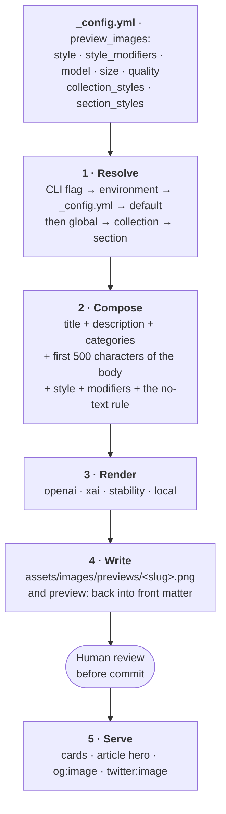

Every article on this site carries a banner that no one drew. A script reads the piece, assembles a prompt from the site's own configuration, sends it to an image model, saves the result under a filename derived from the title, and writes that path back into the article's front matter. The theme then renders it on cards, at the top of the article, and as the social card a link preview shows.

That is four systems in a trench coat, and the interesting part is not the model. It is the configuration: which knob decides the look, which decides the filename, which decides whether a banner is regenerated at all, and which of them a person has to approve. This guide is the whole surface, stage by stage, for a practitioner who has to operate it or build the same thing for a client.

It follows the practice's doctrine (see [[The deterministic-first doctrine]]): the pipeline around the model is deterministic and inspectable, the model is spent only where judgment is genuinely needed, and nothing reaches a reader without a person looking at it first.

## The shape of the pipeline

Five stages. Each one is driven by configuration you can read, and each one hands a single artifact to the next.



Stages one through four run on demand from a script. They are never part of `jekyll build`, which keeps builds fast, reproducible, and free of credentials, and keeps the whole thing irrelevant to GitHub Pages safe mode. Stage five is pure Liquid and runs on every build.

The generator is [`scripts/features/generate-preview-images`](https://github.com/bamr87/bashconsultants/blob/main/scripts/features/generate-preview-images), with `scripts/generate-preview-images.sh` as a thin wrapper that the editor tasks call.

## Where every setting lives

Everything about the *look and the mechanics* is the `preview_images:` block of `_config.yml`. Everything about *credentials* is the environment or a git-ignored `.env`. Nothing about either lives in the script.

| Key | Default here | What it decides |
|---|---|---|
| `enabled` | `true` | Whether the pipeline is active at all |
| `provider` | `openai` | Which renderer runs: `openai`, `xai`, `stability`, `local` |
| `model` | `gpt-image-2` | The OpenAI model id |
| `size` | `1536x1024` | Requested pixel dimensions (OpenAI) |
| `quality` | `high` | `low`, `medium`, `high`, or `auto` (OpenAI) |
| `style` | retro pixel art, 8-bit | The base art direction — the brand's visual identity |
| `style_modifiers` | pixelated, CRT glow | Palette, texture, and mood layered on the base |
| `output_dir` | `assets/images/previews` | Where files are written |
| `assets_prefix` | `/assets` | The prefix Liquid adds back at render time |
| `auto_prefix` | `true` | Whether front matter may omit that prefix |
| `collections` | `[posts]` | Which collections a bare run walks |
| `collection_styles` | — | Per-collection style overrides |
| `section_styles` | four sections | Per-section style overrides |
| `xai_model` | `grok-imagine-image-2.0` | The xAI Imagine model id |
| `xai_aspect_ratio` | `3:2` | Imagine aspect ratio, matching the house banner shape |
| `xai_resolution` | `1k` | `1k` or `2k` |
| `xai_quality` | `medium` | `low` or `medium` |

Four layers resolve each value, most specific winning: **a command-line flag where one exists, then an environment variable, then `_config.yml`, then the built-in default.** Only a few keys have flags (`--provider`, `--output-dir`, `--parallel`); everything else is set by environment or config. The environment names mirror the config keys — `AI_PROVIDER`, `IMAGE_MODEL`, `IMAGE_SIZE`, `IMAGE_QUALITY`, `IMAGE_STYLE`, `IMAGE_STYLE_MODIFIERS`, `OUTPUT_DIR`, `XAI_IMAGE_MODEL`, `MAX_PARALLEL` — which makes a one-off experiment a prefix rather than an edit:

```bash
IMAGE_STYLE='flat vector illustration, muted editorial palette' \
  ./scripts/generate-preview-images.sh --dry-run --file pages/_posts/tech/my-post.md
```

`--dry-run` prints the prompt and the destination and calls nothing, which is the right way to develop a style — and the only way to read a prompt before paying for it.

## How a prompt is assembled

The prompt is a template, not a conversation. Knowing its exact shape tells you which parts of an article actually steer the art:

```text
Create a blog preview banner image for an article titled '<title>'.
The article is about: <description>.
Categories: <categories>.
Key themes from content: <the first 500 characters of the body>
Art style: <style>.
Additional style: <style_modifiers>.
The image should be suitable as a wide blog header/banner image with
clean composition. No text or words in the image.
```

Three consequences follow, and they are the difference between a banner that illustrates the piece and one that could belong to any piece on the site.

- **The description is art direction.** It is the one sentence the model gets about the subject. A description written for search engines alone produces a banner about nothing in particular.
- **The opening 500 characters are the rest of it.** A lede that opens on a concrete scene gives the model something to draw. A lede that opens on abstraction gives it a stock-technology collage.
- **The no-text instruction is a request, not a guarantee.** Image models put lettering in images anyway, and the garbled words that result are the single most common reason to regenerate. Every image gets looked at before it is committed.

Categories reach the prompt too, which is a quiet argument for keeping them accurate on posts that will be illustrated.

## Styling: four levers and one house rule

Four levers set the look, in widening specificity.

1. **`style`** — the base art direction for the entire site. This is brand identity, not taste, and it changes about as often as the logo does.
2. **`style_modifiers`** — palette, texture, lighting, and composition notes layered on the base.
3. **`collection_styles`** — an override block keyed by collection, so documentation and articles can diverge.
4. **`section_styles`** — an override block keyed by the directory inside a collection, which on this site is the editorial section.

A file's **collection** is the nearest `_<name>` ancestor directory and its **section** is the directory immediately inside it, matching [Jekyll's own collection layout](https://jekyllrb.com/docs/collections/). So `pages/_posts/erp/2026-01-31-a-post.md` has collection `posts` and section `erp`. Each block may set `style`, `style_modifiers`, `size`, `quality`, or `model`, and later layers win key by key — a section may override the palette and inherit everything else.

The house rule is that **a section may change the genre, never the medium.** Everything here is pixel art, because that is the brand's visual identity and it is what makes a page recognizable as this site. Which *tradition* of pixel art a section draws on is exactly where its editorial voice belongs, and pixel art has plenty of traditions to draw on. A test asserts the invariant — every section style still says "pixel art" — rather than policing which keys a block may set, because the constraint that matters is the medium and not the mechanism.

Here is the whole block, which is also the worked example:

```yaml
preview_images:
  style: 'retro pixel art, 8-bit video game aesthetic, vibrant colors, nostalgic, clean pixel graphics'
  style_modifiers: 'pixelated, retro gaming style, CRT screen glow effect, limited color palette'
  section_styles:
    corp:
      style: '16-bit isometric strategy game pixel art, architectural and infographic, crisp orthogonal pixel grid, restrained and authoritative'
      style_modifiers: 'limited palette of deep navy, slate grey, warm gold and off-white, isometric towers, ledgers, charts and city blocks, orderly composition with generous negative space, sharp unblurred pixel edges, any figures small and anonymous, no clutter'
    erp:
      style: '1990s point-and-click adventure game pixel art, chunky expressive character sprites on a painted interior stage set, comedic staging'
      style_modifiers: 'saturated palette of teal, amber and oxblood, warm practical light from desk lamps and monitors, characters mid-gesture around a counter, desk or shared screen, prop-rich foreground, hand-dithered shading, theatrical composition'
    muses:
      style: 'atmospheric pixel-art landscape, heavy dithered gradients, wide cinematic vista, contemplative lo-fi dusk mood'
      style_modifiers: 'muted palette of violet, deep teal, rust and pale amber, layered parallax silhouettes against a long horizon, a single small figure or lone object for scale, large areas of open sky, soft dithered light bloom, restrained detail'
    tech:
      style: 'technical schematic pixel art, phosphor terminal and blueprint aesthetic, exploded isometric diagrams, precise and diagrammatic'
      style_modifiers: 'tight palette of dark slate, phosphor green, cyan and a single warning amber, scanline glow, wireframe connectors and empty callout boxes carrying no lettering, a workbench or console seen head-on or in clean isometric, engineering-drawing clarity, no decorative flourish'
```

Each one is a pixel-art tradition chosen to match a voice profile in `_data/taxonomy.yml`. Corporate analysis is sharp and strategic for people making spend decisions, so it gets the isometric strategy sim: architectural, orderly, no whimsy. Business-systems writing is performed comedy with a lesson underneath, so it gets the point-and-click adventure, where a cast on a stage set is the whole point. Essays are reflective and long, so they get the atmospheric landscape: wide, quiet, one small figure for scale. Technical guides are crisp instructions, so they get the phosphor terminal and the engineering drawing, where nothing is decorative.

Note what stays global. The base `style` and `style_modifiers` still apply to anything outside a section — the news index at the top of the collection, and any post filed flat — so the publication as a whole keeps the general house look while its sections diverge underneath it.

The resolution runs in [`scripts/features/lib/preview_styles.py`](https://github.com/bamr87/bashconsultants/blob/main/scripts/features/lib/preview_styles.py), and a lookup that cannot answer returns no overrides rather than failing a run.

Verify a change before spending anything. The same file under two sections produces two different prompts:

```bash
python3 scripts/features/lib/preview_styles.py pages/_posts/erp/2026-01-31-erp-frankenstein.md
# style_modifiers   pixelated, retro gaming style, CRT screen glow effect, warm stage lighting, ...
# _layers           section:erp
```

Two things to hold in mind. A style block changes **only images generated after it**, so a section adopts its look as its pieces are regenerated, not at once. And the same override keys are how [zer0-image-generator](https://rubygems.org/gems/zer0-image-generator) spells its own collection styles, so a block written here transfers unchanged if this site moves to that engine.

## Providers and their credentials

Four renderers ship. The provider is a config key and a `--provider` flag, and the credential each one needs is separate from it.

| Provider | Endpoint | Credential | Notes |
|---|---|---|---|
| `openai` | `/v1/images/generations` | `OPENAI_API_KEY` | The default. Honors `size` and `quality`. See the [image generation guide](https://platform.openai.com/docs/guides/image-generation) |
| `xai` | `/v1/images/generations` | Subscription sign-in, key last | [xAI Imagine](https://docs.x.ai/docs/guides/image-generations); returns JPEG, converted to PNG |
| `stability` | Stable Diffusion XL | `STABILITY_API_KEY` | Square output only |
| `local` | none | none | A stub that writes the prompt to a text file, for testing the plumbing |

Credentials never reach a command line. Every provider writes its bearer header into a mode-600 curl configuration file, because command-line arguments are readable by every process on the host.

The xAI path is the one worth understanding, because it authenticates with a **subscription rather than a metered key**. xAI documents only an API key; the OAuth flow is the one Kilo Code ships in the open, ported here from a sibling project, reusing the public Grok command-line client that xAI's authorization server allowlists. `scripts/features/xai-login` mints the token with an [RFC 8628 device-code grant](https://datatracker.ietf.org/doc/html/rfc8628) by default — it prints a URL and a short code, needs no inbound network path, and therefore works from a laptop, a server, or a container alike — with a loopback grant available where a browser sits on the same machine.

The credential chain then resolves, first hit winning: an explicit environment token, this repository's own store, the Grok command-line store, a local Kilo login, and a metered key last. The store is written atomically at mode 600 and is git-ignored. Because xAI rotates the refresh value on every use, refreshes run under an exclusive lock so two generator workers cannot invalidate each other, and a mid-run rejection triggers exactly one refresh and retry.

## The filename and path contract

This is the part that bites, so it is worth stating precisely.

The filename comes from the **title**, not the file path. Lowercase it, replace every run of non-alphanumeric characters with a single hyphen, strip leading and trailing hyphens, truncate to 50 characters:

```text
"Frankenstein's ERP: the monster you already own"
  → frankenstein-s-erp-the-monster-you-already-own.png
```

The generator writes the image to `assets/images/previews/` and stamps the **short form** into front matter:

```yaml
preview: /images/previews/frankenstein-s-erp-the-monster-you-already-own.png
```

The `/assets` prefix is added back at render time from `assets_prefix`, so both forms resolve. The short form is the house convention and the one the generator writes; matching it keeps a whole-repo search meaningful.

Because the filename derives from the title, **retitling a published piece orphans its banner.** The article keeps pointing at the old filename, which still exists, and the new title would generate a different one. Retitle and regenerate in the same change, or rename the file and update the front matter by hand. That is not a bug to be fixed so much as a property to know: it is what makes the filename readable and stable in the first place.

## How a banner reaches the reader

Stage five is entirely Liquid, so it runs identically in local development, on GitHub Pages, and on Azure.

- **Cards and heroes** go through the theme's `components/preview-image.html`, which normalizes the path, sets lazy loading, and takes the article title as alternative text. Section and news layouts use it for grid cards; the article layout uses it for the optional hero at the top of a piece.
- **Social cards** go through `content/seo.html`, which emits `og:image` and `twitter:image` from `page.preview` unless a standard `page.image` is set, in which case the `jekyll-seo-tag` plugin owns those tags and the include stays quiet to avoid duplicates. The [Open Graph protocol](https://ogp.me/) is what link previews read.
- **Fallbacks** keep a page from ever rendering a broken image: cards fall back to `site.teaser`, social cards to `site.og_image`. A missing banner is therefore invisible in the build and visible only as a generic card in the wild, which is exactly why `--list-missing` is the first command in the next section.

There is also a Jekyll plugin, `_plugins/preview_image_generator.rb`, providing Liquid filters and a build-time count of documents missing a banner. Two things about it are deliberate. It **generates nothing** — the name is historical, and the actual generation is the script. And because GitHub Pages builds in safe mode and never loads local plugins, its report is a development-time signal only, so nothing in any layout depends on it. Keep it that way: a template that called one of its filters would render locally and fail in production.

## Managing the set

The commands, in the order a normal week uses them:

```bash
# What is missing? No API calls, no spend.
./scripts/generate-preview-images.sh --list-missing

# What would be sent? Prints the full prompt per file.
./scripts/generate-preview-images.sh --dry-run --verbose

# Fill in everything that lacks a banner.
./scripts/generate-preview-images.sh --collection posts

# Repaint one piece after a retitle or a style change.
./scripts/generate-preview-images.sh --force --file pages/_posts/tech/my-post.md

# Paint with the subscription renderer instead of the metered one.
./scripts/features/xai-login          # once
./scripts/generate-preview-images.sh --provider xai --collection posts
```

A few operational facts. Runs are parallel at four workers by default, tunable with `--parallel` or `MAX_PARALLEL`; one collection run therefore beats a shell loop over single files, which pays process startup each time and never engages the pool. `--force` is what regenerates an image that already exists, and pairing it with `--file` rather than running it site-wide is a deliberate habit, because each render is billed per image and a whole-site repaint is a budget decision rather than a keystroke. `--enhance` sends an existing image back for improvement through the OpenAI edit endpoint and backs the original up to `<name>_pre-enhance.png`, which is git-ignored.

The governing discipline is the order of operations: **write, review, finalize the title, then generate.** Titles are load-bearing for filenames, so generating before a title is settled produces orphans. And every image is looked at by a person before it is committed — for lettering artifacts, for whether it actually depicts the subject, and for whether it belongs to the same site as its neighbors.

## The editing surface

Front matter is text, and the whole pipeline works with an editor and a shell. It is also a set of typed fields, and treating it that way removes a class of mistake.

This repository ships a configuration for [Front Matter](https://frontmatter.codes/), a content management system that runs inside the editor, in `frontmatter.json` that declares `preview` as `type: image` with `assets` as the public folder, which turns the field into a picker with a thumbnail inside the editor rather than a path someone types.

The successor is [zer0-CMS](https://github.com/bamr87/zer0-CMS), which keeps that interaction design and rebuilds the layer underneath: a metadata panel that renders front matter as typed controls, a content dashboard, and a publishing path that runs draft, then brand guard, then a human approval recorded in the file, then publish, then a ledger keyed by canonical address. Two of its choices are worth borrowing no matter which system a client ends up with.

- **It generates no images.** Its media module resolves what the generator already produced — from front matter, or by convention from the previews directory — and where there is none it emits the request the generator takes as input. A second renderer would be a second definition of what a preview image is, and the two would drift.
- **It asks the question across the whole content set.** Publishing a single post without a thumbnail is the right behavior and should never block. Doing it forty times is drift, and the only way to notice is to ask about the set rather than the page.

That is the same split this site runs on: one engine, many surfaces, and a person on the approval.

## The portable engine

The script described here is this site's own, and it is a fork of a lineage that has since been extracted into a portable engine — `zer0-image-generator`, published as a gem and usable as a Jekyll subcommand, a standalone Python file, or a web application. It is worth knowing what that engine adds, because the gap is the honest roadmap for this pipeline:

| Capability | This site's script | zer0-image-generator |
|---|---|---|
| Template prompt | yes | yes |
| An art brief written per article by a language model | no | yes |
| Vision review of the render, with one refined retry | no | yes |
| Provider ladder that picks the best reachable renderer | no | yes |
| Deterministic key-free local renderer | stub only | content-aware vector renderer |
| Shared fallback banner per section | no | yes |
| Per-collection styles | yes | yes |
| Per-section styles | yes | not yet — a candidate to contribute upstream |
| Per-author styles | no | yes |
| Configurable front-matter key | no, always `preview` | yes |
| Vector-only output | no | yes |
| xAI Imagine over a subscription sign-in | yes | key-based only |

The two implementations agree exactly where it matters: the slug rule and the front-matter path convention are the same, so adopting the engine would not rename a single existing file. The two capabilities most worth having are the art brief and the vision review, because between them they address the failure this pipeline actually has — a template prompt produces generic art, and nothing but a person currently catches lettering artifacts.

The doctrine argument points the same way. Two implementations of one idea drift, and the fleet's own rule is one engine with many surfaces. That makes engine adoption a real piece of planned work rather than a nice-to-have, and the per-section styling above was built to transfer rather than to entrench the fork.

## Watch-outs

- **Retitling orphans a banner.** Regenerate in the same change, or the article silently keeps the old art under the old name.
- **The plugin does not run in production.** Its missing-banner report is a development signal. Never let a layout depend on its filters.
- **Models put text in images.** The prompt forbids it and they do it anyway. Review every render.
- **A thin description makes generic art.** The description and the opening paragraph are the only subject matter the model receives.
- **Style blocks are not retroactive.** Changing a section's block affects nothing already on disk.
- **Site-wide `--force` is a spend decision.** Scope it with `--file` or `--collection` unless a repaint is genuinely the intent.
- **Credentials belong in the environment.** A git-ignored `.env` and the subscription store, never a command line and never the repository.

## Next step

The interesting thing about this pipeline is not that it generates images. It is that every decision it makes is a line in a file someone can read, argue with, and change, and that the one judgment a machine is bad at — is this picture right — is the one a person still makes. That pattern generalizes well past banner art, and it is how we build the automation we hand to clients. If you are designing a content pipeline of your own and want a second reader on where the model belongs in it, see our [[AI solutions and intelligent automation]].
